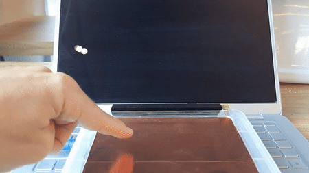

## NeoNode zForce

### Hardware

Connections: see firmware.ino

More: https://www.digikey.com/short/p3374r

### Firmware

If you use a "classic" Arduino (AVR architectures...) your I2C buffer memory is too small for the official lib, but this lib solves the problem:

https://github.com/stephaneAG/zforce-arduino

### Software

If you don't have it, install processing.org and run viz.pde, or execute this command:

    processing-java --sketch=viz --run

### More

https://neonode.com/technologies/zforce

